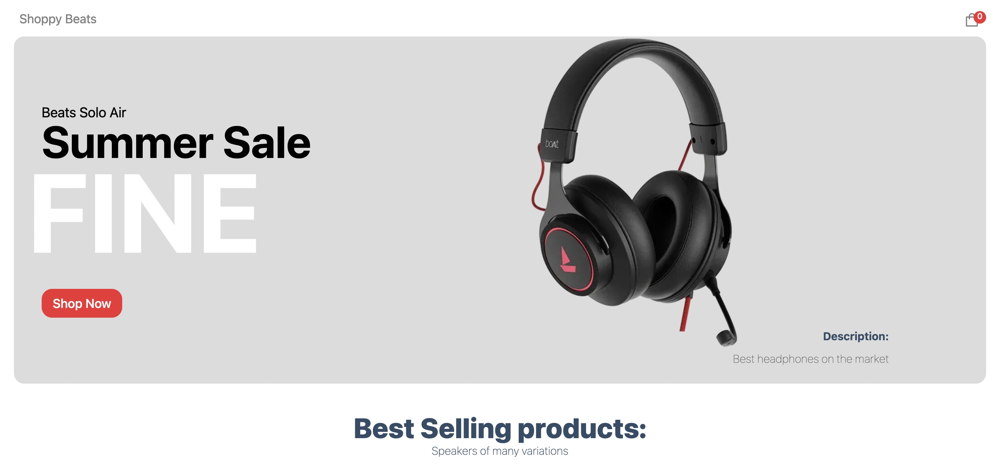
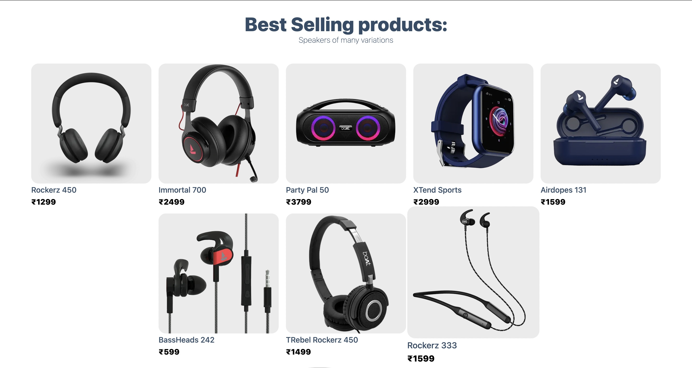

# Shoppy

A <b>Full Stack Ecommerce Web App using <a href="https://nextjs.org/">Next JS</a> and <a href="https://www.sanity.io/">Sanity </a></b>. It is <b>Fully Responsive</b> as uses <b><a href="https://www.sanity.io/">Stripe </a></b> as the payment authentication.

## Deployment

You can run it locally using :-
```bash
npm run dev
```

To change and add data on the database use :-
```bash
cd sanity_shoppy

sanity start
```

but first youll need a `.env` file with the following :-
```code
NEXT_PUBLIC_SANITY_TOKEN = { Enter the Token you recieve on creating account }
NEXT_PUBLIC_STRIPE_PUBLISHABLE_KEY = { Enter the Publishable Key recieved on actiavting Stripe Account }
NEXT_PUBLIC_STRIPE_SECRET_KEY = { Enter the Secret Key from your Stripe Account }
```


## Showcase
The Website is live at :- 
<br />
[](https://app.netlify.com/sites/shoppy-io/deploys)
<br />
https://shoppy-io.netlify.app/


## Preview






